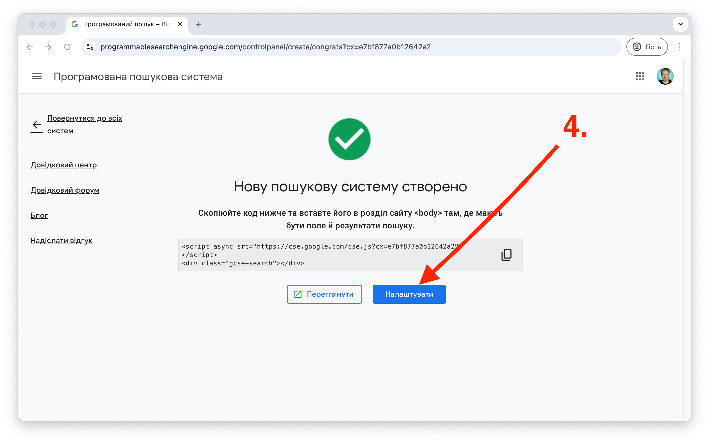
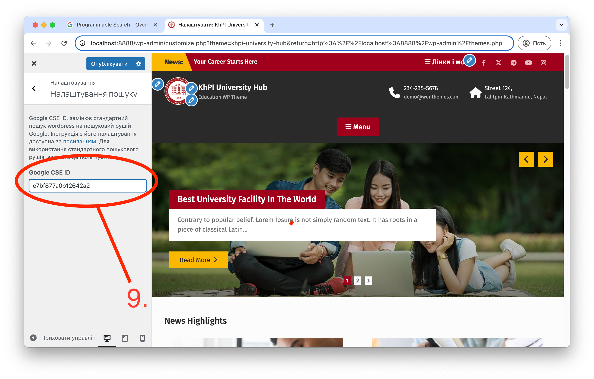

# Налаштування Google Programmable Search Engine

Використання пошукового рушія Google, надає більш точний та релевантний пошук, в тому числі по завантаженим на сайт PDF документам, навіть при помилках або неточностях у пошукових запитах.

Для його налаштування потрібно отримати унікальний для кожного сайту ідентифікатор. Щоб його отримати виконайте декілька простих кроків:

## 1. Перейдіть на сторінку сервісу

Панель адміністратора пошукового рушія доступна за посиланням [https://programmablesearchengine.google.com/](https://programmablesearchengine.google.com/). Натисніть **Get started** та увійдіть за допомогою свого Google аккаунта.

## 2. Додайте пошукову систему

## 3. Додайте назву і посилання на сайт

> [!IMPORTANT]  
> Передайте посилання на кореневий каталог сайту, наприклад `https://web.kpi.kharkov.ua/es`. Вставка посилання на головну сторінку, якшо її адреса не веде до кореневого каталогу, (наприклад `https://web.kpi.kharkov.ua/es/uk/golovna/`) призведе до неправильної роботи пошуку.

## 4. Перейдіть в налаштування пошукової системи

## 5. Перейдіть в розділ "Зовнішній вигляд"

## 6. Оберіть макет "На всю ширину"

## 7. Поверніться в розділ "Огляд"

## 8. Скопіюйте ідентифікатор пошукової системи

## 9. Додайте ідентифікатор в налаштуваннях wordpress

# Вітаємо! Пошук налаштовано.

