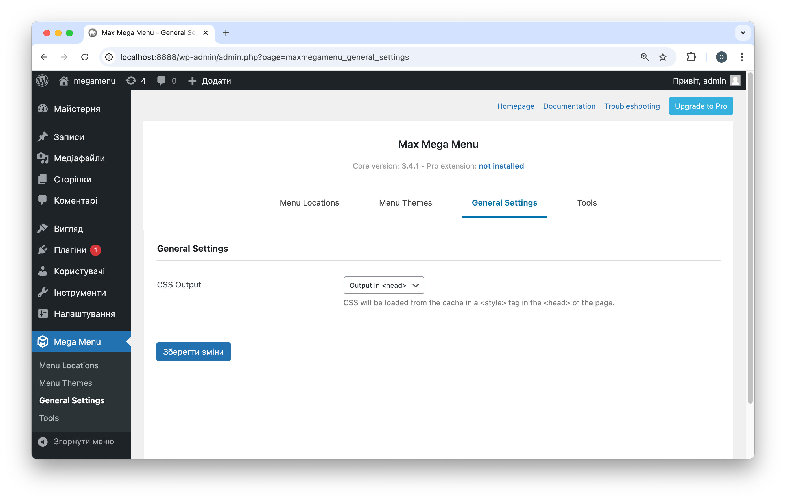
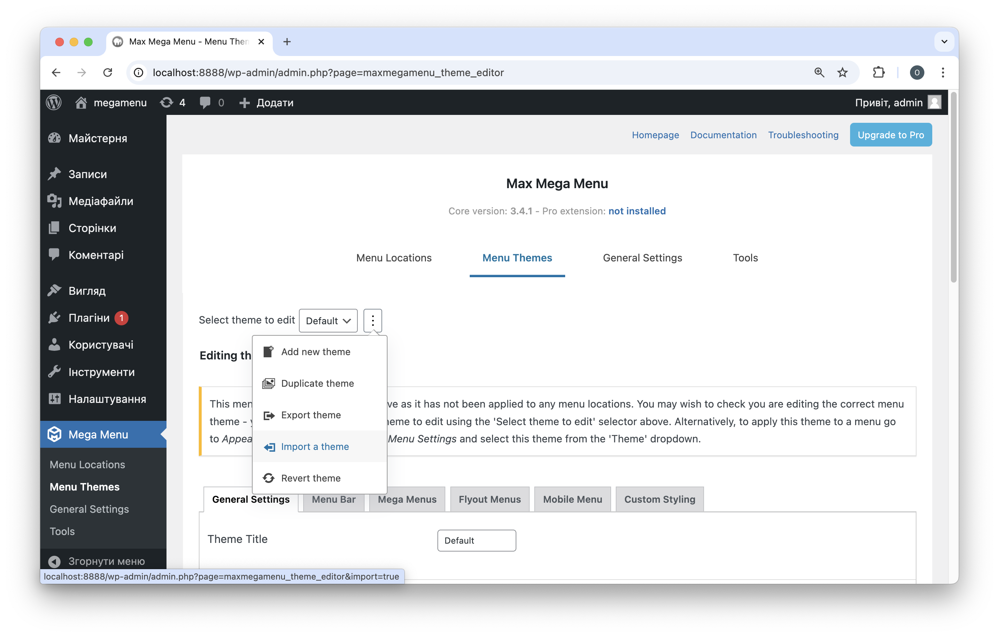
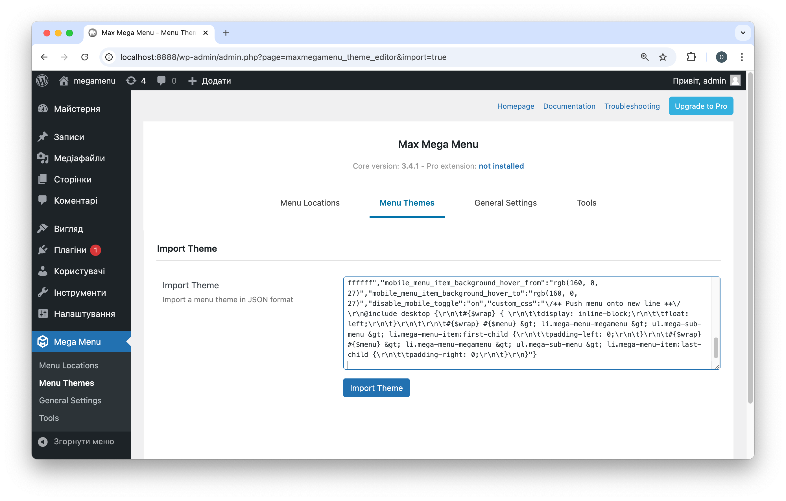
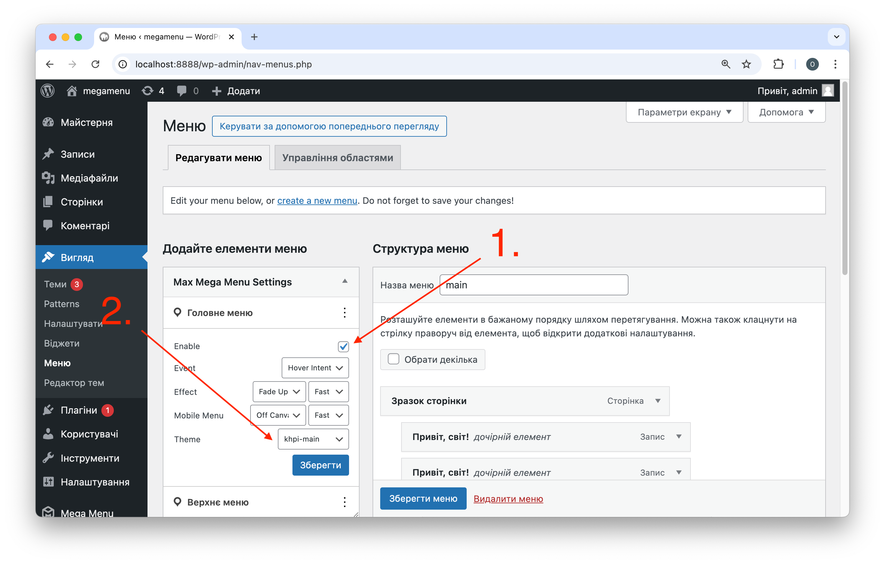
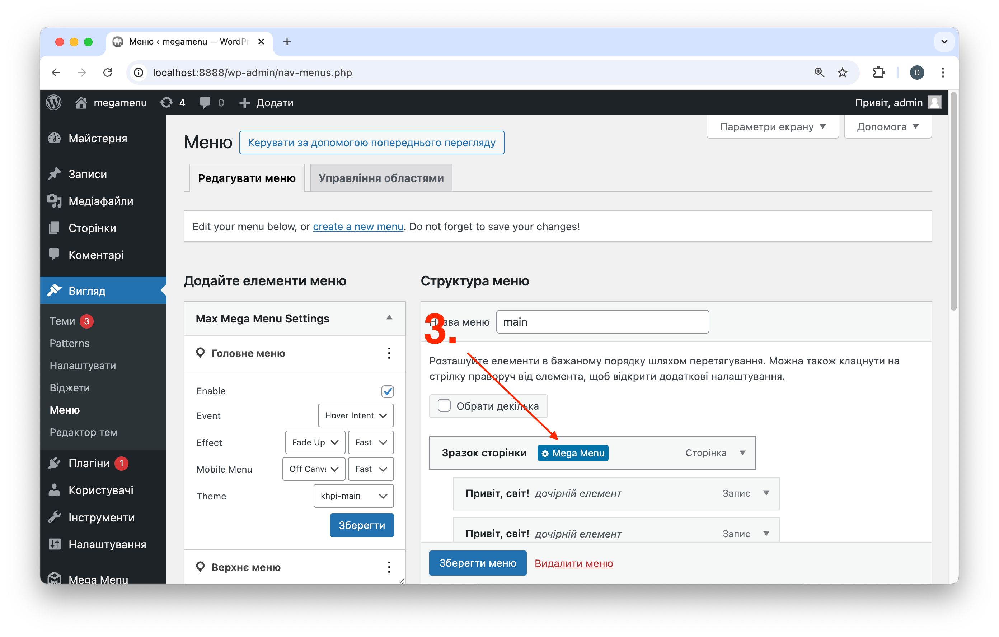
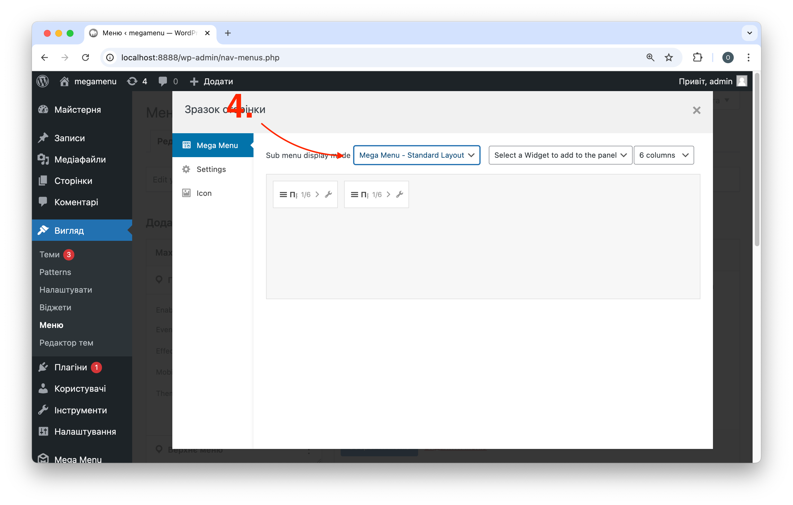
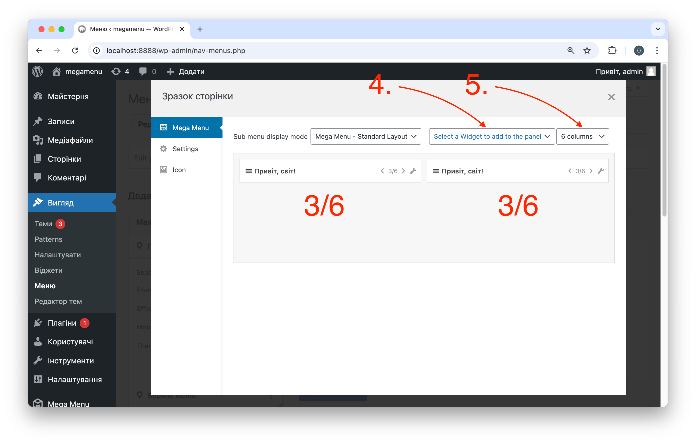

# Встановлення та налаштування плагіну Max Mega Menu в темі KhPI University Hub

## 1. Встановити останню версію плагіну Max Mega Menu з офіційного репозиторію Wordpress
Плагін доступний а посиланням: https://uk.wordpress.org/plugins/megamenu/

Після встановлення активувати плагін

## 2. Змінити місце вставки CSS

Обрати `Output in <head>`

## 3. Перейти в меню імпорту тем

## 4. Імпортувати 2 теми відповідно для верхнього та головного меню

Налаштування імпортуються шляхом вставки вмісту JSON файлів `khpi-main.json` та `khpi-tophead.json`

## 5. Увімкнути Mega Menu для відповідних меню, та обрати імпортовані теми

## 6. Обрати макет для кожного з елементів меню верхнього рівня

## 7. Налаштувати макет відповідно до потреб

1. Обрати к-ть колонок
2. Додати необхідні елементи до макету
3. Вказати ширину для кожного з елементів 

